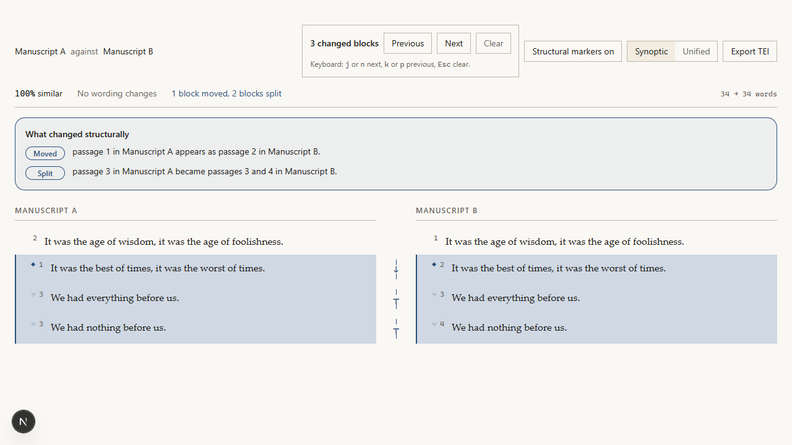

# palimpsest

```text
             _ _                               _
 _ __   __ _| (_)_ __ ___  _ __  ___  ___  ___| |_
| '_ \ / _` | | | '_ ` _ \| '_ \/ __|/ _ \/ __| __|
| |_) | (_| | | | | | | | | |_) \__ \  __/\__ \ |_
| .__/ \__,_|_|_|_| |_| |_| .__/|___/\___||___/\__|
|_|                       |_|

   A | It was the best of times, it was the worst     of times.
     |                                      -----
   B | It was the best of times, it was the strangest of times.
     |                                      +++++++++
```

[](https://github.com/jQuinRivero/palimpsest/actions/workflows/ci.yml)
[](https://github.com/jQuinRivero/palimpsest/actions/workflows/docs.yml)
[](LICENSE)
[](backend/pyproject.toml)

**A typography-first collation reader for comparing two versions of a literary
text.**

`palimpsest` shows wording changes and structural revision without turning
prose into a source-code patch. It aligns passages before comparing words, so a
moved paragraph can remain a move, a paragraph split can remain a split, and
only genuinely revised words are marked as insertions or deletions.



In this example:

- **nothing** becomes **little**;
- passage 1 in Manuscript A moves to position 2 in Manuscript B;
- passage 3 in Manuscript A becomes passages 3 and 4 in Manuscript B.

## Documentation

The [user guide and architecture tour](docs-site/index.md) covers installation,
the first comparison, supported formats, reading modes, TEI export, and
troubleshooting.

For implementation and extension work, see the
[technical specification](docs/README.md), [API reference](docs/06-api-reference.md),
and [architecture decisions](docs/adr/README.md).

## Why palimpsest?

Traditional diff tools are designed for code: physical lines, monospace text,
and dense red/green patches. Those choices are useful in a pull request and
misleading in a novel, poem, edition, or transcription. Rewrapping one
paragraph can look like a rewrite; moving a passage can look like deletion plus
insertion; splitting a stanza can disappear into line noise.

`palimpsest` separates two questions:

1. **What wording changed?** Inserted and deleted words are marked directly.
2. **What structure changed?** Moved, split, and merged passages are explained
   separately in plain language.

## Features

- **Synoptic and unified reading.** Compare witnesses side by side or as one
  continuous stream.
- **Word-level revision.** Insertions and deletions carry visible `+` and `−`
  cues, token-bounded highlights, and accessible text alternatives.
- **Structural collation.** Detect moved, split, and merged passages without
  inflating the wording-change count.
- **Verse-aware comparison.** Poems are compared line by line, preserving
  stanza boundaries and line movement.
- **Long-manuscript support.** Virtualized reading and paged payloads keep
  large comparisons responsive.
- **Stable citations.** Share expiring comparison links and deep-link to a
  specific passage.
- **TEI P5 export.** Export both witnesses and their structural relationships
  using parallel segmentation.
- **Accessible by design.** Keyboard change navigation, non-colour cues,
  screen-reader announcements, reduced-motion support, and greyscale print
  styles.

## Supported formats

| Format | What palimpsest preserves | Notes |
|---|---|---|
| `.txt` | Text and authored line breaks | Encoding and BOM detection |
| `.md`, `.markdown` | Headings, lists, quotes, and text structure | Inline Markdown styling is normalized away |
| `.docx` | Paragraphs, headings, and style hints | Warns when tracked changes, comments, notes, or text boxes are outside the imported body |
| `.pdf` | Extractable text, page positions, and recurring-page artifacts | Scanned PDFs without a text layer are refused with `OCR_REQUIRED` |

OCR is an extension point, not a bundled service. Multi-witness collation,
annotation, and editorial merging are also outside the current release.

## How palimpsest compares

Digital collation is a well-served field. `palimpsest` is not trying to replace
its algorithms; it is trying to change what a collation *looks like* when a
person sits down to read one.

| | Focus | How `palimpsest` differs |
|---|---|---|
| [CollateX](https://collatex.net/) | The reference collation engine: n witnesses, variant graphs, alignment tables, a scriptable library | Takes two witnesses only, and spends the difference on reading. CollateX is the better tool for building an apparatus across many witnesses; this is the better tool for reading one revision closely |
| [Juxta](https://www.juxtasoftware.org/) | Desktop and hosted collation with heat maps and a side-by-side view | Names structural change explicitly — this passage *moved*, this one *split* — rather than leaving it to be inferred from highlighting |
| [Versioning Machine](https://v-machine.org/) | Displays a TEI parallel-segmentation edition you have already encoded | Produces that TEI from two ordinary documents instead of requiring it as input |
| `diff`, Word "Compare", git | Line- or character-level comparison of files | Those treat prose as source code: rewrapping a paragraph reads as a rewrite, and a moved passage reads as a deletion plus an insertion |

If you encode in TEI and need a formal apparatus criticus across many
witnesses, use CollateX. If you have two drafts, two editions, or a manuscript
and its printed text, and you want to *read* what changed between them, that is
what this is for.

## Installation and quick start

### Run it (no toolchain required)

With [Docker](https://docs.docker.com/get-docker/) installed:

```bash
git clone https://github.com/jQuinRivero/palimpsest.git
cd palimpsest
docker compose up
```

Open <http://localhost:3000>, add Manuscript A and Manuscript B, and select
**Compare manuscripts**.

Your manuscripts never leave your machine: `palimpsest` runs entirely on
`localhost`, sends nothing to any external service, and keeps its session cache
in a local volume. Stop it with `docker compose down`.

### Develop from source

For contributing, or to run without Docker.

**Requirements**

- [uv](https://docs.astral.sh/uv/)
- Python 3.12 or newer
- Node.js 20 or newer

**1. Start the API**

```bash
cd backend
uv venv --python 3.12
uv pip install -e .
uv run --no-sync uvicorn app.main:app
```

The API starts at <http://127.0.0.1:8000>.

**2. Start the web app**

In a second terminal:

```bash
cd frontend
npm ci
npm run dev
```

Open <http://localhost:3000>.

> `npm ci` currently requires npm 11.6.x. Newer npm rejects the lockfile
> because of an upstream defect in how it treats optional WebAssembly peers;
> see [frontend/SECURITY-NOTES.md](frontend/SECURITY-NOTES.md). The Docker path
> above is unaffected.

For development setup and test commands, see
[CONTRIBUTING.md](CONTRIBUTING.md).

## How it works

```text
uploaded witnesses
        ↓
format-aware ingestion and normalization
        ↓
passage alignment and structural detection
        ↓
word-level diff
        ↓
synoptic / unified reading and TEI export
```

The backend is built with FastAPI and SQLite; the reading interface uses
Next.js, React, and Tailwind CSS. The browser renders a structured comparison
payload and does not reimplement the collation algorithm.

## Project status

`palimpsest` is preparing its first `0.1.0` source release. The current scope
is intentionally focused:

- two witnesses per comparison;
- local or trusted deployment;
- shareable expiring links rather than user accounts;
- no hosted OCR, annotation system, or multi-user editorial workspace.

See the [roadmap](docs/14-roadmap.md) for planned directions.

## Contributing

Contributions are welcome. Please read [CONTRIBUTING.md](CONTRIBUTING.md)
before opening a pull request. By participating, you agree to follow the
[Code of Conduct](CODE_OF_CONDUCT.md).

## Issues and security

For bugs, feature requests, and documentation improvements, use the
[GitHub issue tracker](https://github.com/jQuinRivero/palimpsest/issues).

Security issues should **not** be filed publicly. Follow the private reporting
instructions in [SECURITY.md](SECURITY.md).

## Citation

If `palimpsest` contributes to scholarly work, please cite the software. GitHub
can generate a formatted citation from [CITATION.cff](CITATION.cff). Release
notes and version history are in [CHANGELOG.md](CHANGELOG.md).

## License

`palimpsest` is licensed under the [Apache License 2.0](LICENSE).
Third-party licences and attributions are listed in
[THIRD-PARTY-NOTICES.md](THIRD-PARTY-NOTICES.md) and [NOTICE](NOTICE).
