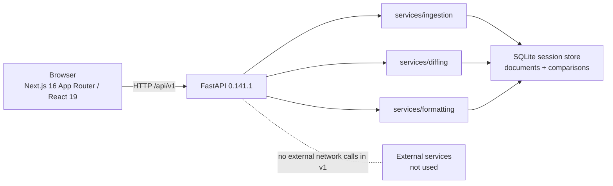
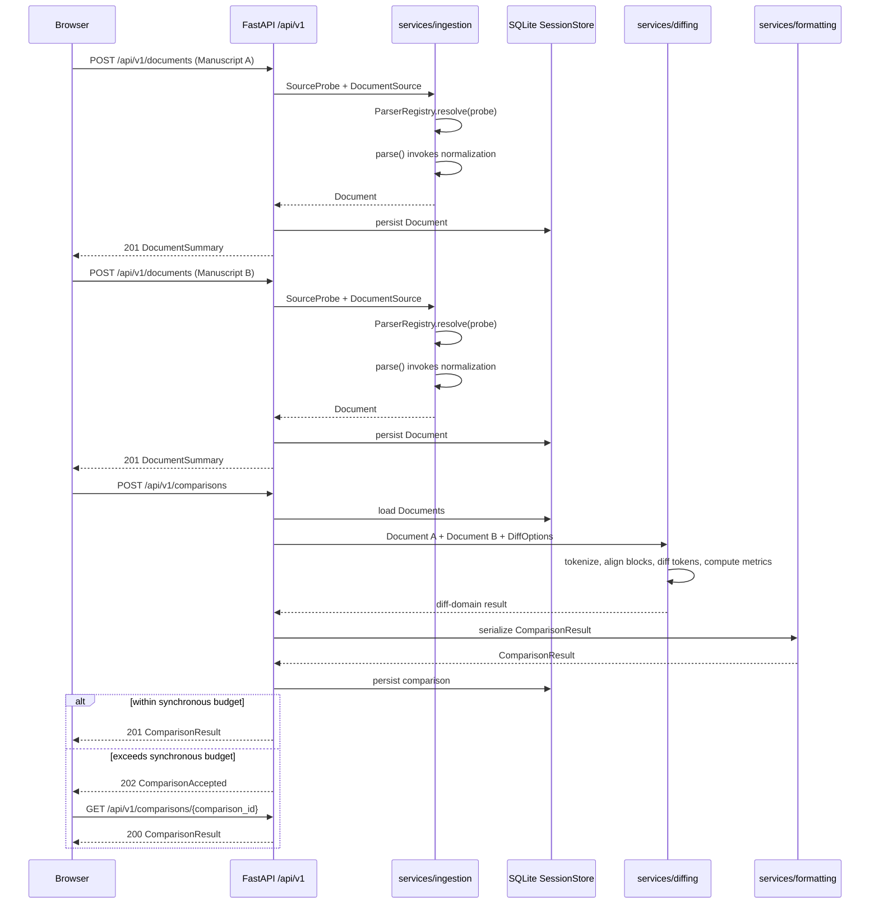

This document defines the system architecture, service boundaries, request lifecycle, deployment topology, and technology choices for `palimpsest`.

**Status:** Draft

**Related:** [Overview](./00-overview.md) · [Ingestion and parsers](./02-ingestion-and-parsers.md) · [Normalization](./03-normalization.md) · [Diff engine](./04-diff-engine.md) · [Data schema](./05-data-schema.md) · [API reference](./06-api-reference.md) · [Session storage](./07-session-storage.md) · [Frontend architecture](./08-frontend-architecture.md) · [Performance and scale](./11-performance-and-scale.md) · [Architecture decision records](./adr/README.md)

## System context

`palimpsest` is a two-part web application. The Browser runs the Next.js App Router client, the backend API is FastAPI, and all v1 persistence is local SQLite session storage with TTL expiry. Diffing happens server-side; the client renders a finished JSON payload.

No external network calls occur in v1. That boundary is intentional: future OCR activation may introduce a parser with `requires_network = True`, but the v1 deployment story is a single host plus one SQLite store.



## Module map

### Backend tree

The backend module tree is normative and must match the contract exactly.

```text
backend/app/
  api/v1/{documents,comparisons,health,capabilities}.py
  services/ingestion/{base,registry,plaintext,markdown,docx,pdf_plumber,pdf_pypdf,normalize}.py
  services/diffing/{engine,alignment,tokenizer,metrics,moves}.py
  services/formatting/{payload,tei}.py
  storage/{store,sqlite_store,schema.sql,sweeper}.py
  models/{document,diff,api}.py
  config.py  main.py
```

| Module path | Owns |
|---|---|
| `backend/app/api/v1/documents.py` | `POST /api/v1/documents`, `GET /api/v1/documents/{document_id}`, and `DELETE /api/v1/documents/{document_id}` orchestration. |
| `backend/app/api/v1/comparisons.py` | `POST /api/v1/comparisons`, `GET /api/v1/comparisons/{comparison_id}`, `GET /api/v1/comparisons/{comparison_id}/blocks`, and `DELETE /api/v1/comparisons/{comparison_id}` orchestration. |
| `backend/app/api/v1/health.py` | `GET /api/v1/health` and `HealthResponse`. |
| `backend/app/api/v1/capabilities.py` | `GET /api/v1/capabilities` and `CapabilitiesResponse`. |
| `backend/app/services/ingestion/base.py` | `BaseDocumentParser`, `AsyncDocumentParser`, `AsyncOCRParser`, `ParserCapabilities`, `SourceProbe`, and `DocumentSource` contracts. |
| `backend/app/services/ingestion/registry.py` | `ParserRegistry.resolve(probe) -> type[BaseDocumentParser]`. |
| `backend/app/services/ingestion/plaintext.py` | `PlainTextParser` for `TXT` witnesses. |
| `backend/app/services/ingestion/markdown.py` | `MarkdownParser` for `MARKDOWN` witnesses. |
| `backend/app/services/ingestion/docx.py` | `DocxParser` for `DOCX` witnesses. |
| `backend/app/services/ingestion/pdf_plumber.py` | `PdfPlumberParser` for primary `PDF` extraction. |
| `backend/app/services/ingestion/pdf_pypdf.py` | `PyPdfParser` fallback behavior for `PDF` extraction. |
| `backend/app/services/ingestion/normalize.py` | Canonical block segmentation, whitespace normalization, dehyphenation, artifact handling, offsets, and metadata. |
| `backend/app/services/diffing/engine.py` | End-to-end collation of two `Document` values into diff-domain results. |
| `backend/app/services/diffing/alignment.py` | Block similarity matrix construction and block alignment. |
| `backend/app/services/diffing/tokenizer.py` | `Granularity`-aware tokenization for `WORD` and `CHARACTER`. |
| `backend/app/services/diffing/metrics.py` | `BlockMetrics` and `DiffMetrics` computation. |
| `backend/app/services/diffing/moves.py` | `MOVED`, `SPLIT`, and `MERGED` detection. |
| `backend/app/services/formatting/payload.py` | Serialization of a diff-domain result into `ComparisonResult`, `BlockPage`, and related API payloads. All three token streams — unified, Manuscript A, and Manuscript B — are produced here rather than in separate modules, because they are apportioned from one diff and splitting them would invite the group's tokens being diffed twice. |
| `backend/app/services/formatting/tei.py` | TEI P5 export using the parallel segmentation method; see [ADR-0006](./adr/0006-tei-parallel-segmentation-export.md). |
| `backend/app/storage/store.py` | `SessionStore` protocol for documents, comparisons, expiry, and pagination. |
| `backend/app/storage/sqlite_store.py` | SQLite implementation of `SessionStore`. |
| `backend/app/storage/schema.sql` | `documents`, `comparisons`, and `schema_migrations` schema plus required pragmas. |
| `backend/app/storage/sweeper.py` | TTL cleanup for expired documents and comparisons. |
| `backend/app/models/document.py` | `Token`, `ParserCapabilities`, `IngestionWarning`, `BoundingBox`, `Block`, `DocumentMetadata`, `Document`, and `DocumentSummary`. |
| `backend/app/models/diff.py` | `TokenStatus`, `BlockStatus`, `BlockKind`, `SourceFormat`, `Granularity`, `BlockMetrics`, `DiffBlock`, `DiffMetrics`, `DiffOptions`, and `ComparisonResult`. |
| `backend/app/models/api.py` | API-only models including `BlockPage`, `ComparisonAccepted`, `CapabilitiesResponse`, `HealthResponse`, and RFC 9457 problem details. |
| `backend/app/config.py` | Configuration using `pydantic-settings`. |
| `backend/app/main.py` | FastAPI application creation, middleware, routing, CORS, and request ids. |

### Frontend tree

The frontend uses Next.js 16 App Router routes `/` and `/c/[comparisonId]`.

```text
frontend/
  app/
    page.tsx
    c/[comparisonId]/page.tsx
  components/
    ManuscriptUploader.tsx
    DiffViewer.tsx
    VirtualizedSynopticView.tsx
    VirtualizedUnifiedView.tsx
    DiffSummaryBar.tsx
    DiffBlockRow.tsx
    TokenSpan.tsx
    ChangeGutter.tsx
    ChangeNavigator.tsx
    LoadingProgress.tsx
    ComparisonPending.tsx
    BlockConnector.tsx
    EmptyState.tsx
  lib/
    api.ts
    types.ts
    waitForComparison.ts
    hooks/
      useBlockNavigation.ts
      useWindowedBlocks.ts
      usePrintAll.ts
```

| Frontend path | Owns |
|---|---|
| `frontend/app/page.tsx` | Upload route `/`, centered on `ManuscriptUploader`. |
| `frontend/app/c/[comparisonId]/page.tsx` | Viewer route `/c/[comparisonId]`, loading and rendering a `ComparisonResult`. |
| `frontend/components/` | `ManuscriptUploader`, `DiffViewer`, `VirtualizedSynopticView`, `VirtualizedUnifiedView`, `DiffSummaryBar`, `DiffBlockRow`, `TokenSpan`, `ChangeGutter`, `ChangeNavigator`, `LoadingProgress`, `ComparisonPending`, `BlockConnector`, and `EmptyState`. `ViewModeToggle` is a private component inside `DiffViewer.tsx`, not a separate module: it is three buttons with no state of its own and no second consumer. |
| `frontend/lib/api.ts` | Thin API client for `/api/v1` endpoints. |
| `frontend/lib/types.ts` | TypeScript mirror of the JSON payload contract from [Data schema](./05-data-schema.md). |
| `frontend/lib/hooks/useBlockNavigation.ts` | Active block, next/previous change traversal, focus, and the `?block=<index>` deep link. |
| `frontend/lib/hooks/useWindowedBlocks.ts` | Loading the remaining windows of a truncated comparison, and reporting honest progress while it does. |
| `frontend/lib/hooks/usePrintAll.ts` | Suspending virtualization while the browser prints, so paper receives the whole collation rather than the mounted window. |
| `frontend/lib/waitForComparison.ts` | Bounded, jittered polling for a comparison the server accepted but has not finished. |

URL state is read where it is used rather than centralized in a `url-state` module: `?view=` is resolved server-side in the viewer route, `?moves=` in `DiffViewer`, and `?block=` in `useBlockNavigation`. A shared module would have been a single import with three unrelated consumers.

## The three services and their boundaries

The backend has three service layers: `ingestion`, `diffing`, and `formatting`. Each layer has a narrow contract and must not reach across boundaries.

**Invariant:** ingestion is the only layer that knows about file formats; the diffing layer only ever sees the canonical `Document` model. This is what makes the future `AsyncOCRParser` a drop-in parser rather than a diff-engine rewrite.

### `ingestion`

| Concern | Specification |
|---|---|
| Responsible for | Probing source bytes, resolving a parser, parsing the witness, normalizing text, producing `Block` values, setting `SourceFormat`, computing `DocumentMetadata`, and emitting `IngestionWarning` values. |
| Must not know about | Block alignment, token diffing, `DiffBlock`, `DiffMetrics`, `ViewMode`, `SYNOPTIC`, `UNIFIED`, or frontend layout. |
| Input type | `DocumentSource`, selected through `SourceProbe` and `ParserRegistry.resolve(probe) -> type[BaseDocumentParser]`. |
| Output type | Canonical `Document`. |

Every concrete parser implements `BaseDocumentParser`. `PlainTextParser`, `MarkdownParser`, `DocxParser`, `PdfPlumberParser`, and `PyPdfParser` may differ internally, but all return the same `Document` model. `AsyncOCRParser` is future scope and follows the same output rule.

### `diffing`

| Concern | Specification |
|---|---|
| Responsible for | Tokenization, block alignment, word-level or character-level diffing, `MOVED` detection, `SPLIT` detection, `MERGED` detection, and metrics. |
| Must not know about | `.txt`, `.md`, `.docx`, `.pdf`, OCR providers, magic bytes, multipart upload, API status codes, JSON pagination, or React components. |
| Input type | Two canonical `Document` values plus `DiffOptions`. |
| Output type | Diff-domain blocks and metrics suitable for formatting into `ComparisonResult`. |

The diffing layer treats `Block.text`, `Block.kind`, `Block.index`, and normalized offsets as its input surface. It does not inspect parser names except when metrics or diagnostics need already-normalized metadata.

### `formatting`

| Concern | Specification |
|---|---|
| Responsible for | Wire payload shape, `ComparisonResult` serialization, `BlockPage` pagination, unified token stream construction, Manuscript A and Manuscript B panes, truncation metadata, and export serialization. |
| Must not know about | Source format parsing, magic bytes, parser fallback behavior, or the internals of the diff library. |
| Input type | Diff-domain blocks and metrics from `diffing`, plus `DocumentSummary` values and `DiffOptions`. |
| Output type | `ComparisonResult`, `BlockPage`, or a TEI P5 document. |

`formatting` owns the API payload shape so the diff engine never thinks about the UI. The client receives `tokens`, `a_tokens`, and `b_tokens` already prepared for `UNIFIED` and `SYNOPTIC` rendering.

## Request lifecycle

1. The client uploads Manuscript A with `POST /api/v1/documents`.
2. The client uploads Manuscript B with `POST /api/v1/documents`.
3. For each upload, the API builds a `SourceProbe` from filename, media type, magic bytes, and size.
4. `ParserRegistry.resolve(probe)` selects a `type[BaseDocumentParser]`.
5. The selected parser extracts format-native text and structure; `parse(source: DocumentSource) -> Document` returns the canonical `Document`.
6. As part of that parse path, `services/ingestion/normalize.py` applies canonical normalization, including block segmentation, whitespace handling, dehyphenation, artifact block handling, offsets, metadata, and warnings.
7. The backend persists the `Document` in the `documents` table and returns `201` `DocumentSummary`.
8. The client creates a comparison with `POST /api/v1/comparisons` using `{a_document_id, b_document_id, options?}`.
9. The backend retrieves both `Document` values.
10. `services/diffing/tokenizer.py` tokenizes each relevant block according to `DiffOptions.granularity`.
11. `services/diffing/alignment.py` aligns blocks using similarity thresholds.
12. `services/diffing/engine.py` word-diffs each aligned pair by default.
13. `services/diffing/moves.py` classifies `MOVED`, `SPLIT`, and `MERGED` relationships.
14. `services/diffing/metrics.py` computes `BlockMetrics` and `DiffMetrics`.
15. `services/formatting/payload.py` serializes the result as `ComparisonResult`.
16. The backend persists the comparison in the `comparisons` table and returns `201` `ComparisonResult`.
17. The client navigates to `/c/[comparisonId]`, fetches `GET /api/v1/comparisons/{comparison_id}`, and renders `DiffViewer`.

If the diff exceeds the synchronous processing budget, step 16 diverges: the API persists a pending comparison and returns `202` `ComparisonAccepted` with a `comparison_id`; the client polls `GET /api/v1/comparisons/{comparison_id}` until the `ComparisonResult` is available. [Performance and scale](./11-performance-and-scale.md) defines the budget that triggers this path.



## Synchronous vs background processing

Most comparisons complete synchronously and return `201` `ComparisonResult` from `POST /api/v1/comparisons`. FastAPI `BackgroundTasks` are reserved for post-response cleanup such as opportunistic TTL sweeping and removal of expired rows.

When a diff exceeds the synchronous processing budget, the API returns `202` `ComparisonAccepted` with a `comparison_id`. The client polls `GET /api/v1/comparisons/{comparison_id}` and renders the `ComparisonResult` once available. The API must use RFC 9457 `application/problem+json` with code `DIFF_BUDGET_EXCEEDED` only when the work cannot be accepted into the background path.

v1 deliberately avoids Celery, Redis, or any external broker. A single FastAPI process with SQLite is the whole deployment story. Adding a broker is roadmap scope because it changes the operational model and the `SessionStore` implementation.

## Deployment topology

### Development

Development runs two local servers:

- FastAPI served by uvicorn on one port.
- Next.js served by `next dev` on a second port.

CORS is enabled for the development frontend origin. The frontend calls the `/api/v1` backend and receives typed JSON payloads. SQLite stores documents and comparisons in a local database using WAL mode.

### Single-host production

Production is a single-host deployment:

- a container running uvicorn behind a reverse proxy;
- Next.js built and served statically or by its own node process;
- one SQLite database file on a persistent volume;
- TTL sweeping for expired documents and comparisons.

SQLite with `journal_mode=WAL` supports concurrent readers but means **one writer process** for this architecture. Horizontal scaling requires swapping the store, which is why [Session storage](./07-session-storage.md) specifies a `SessionStore` protocol rather than binding callers directly to `sqlite_store.py`.

## Technology choices

Pinned dependency versions are floors verified at authoring, not lockfile entries. Any dependency proposal must include license analysis because the project is Apache-2.0 and copyleft dependencies are disqualifying.

| Dependency | Version floor | License | Why |
|---|---:|---|---|
| `diff-match-patch` | 20241021 | Apache-2.0 | Provides proven token diff primitives on the server; see [ADR-0001](./adr/0001-diff-match-patch-fork.md). |
| `rapidfuzz` | 3.13.0 | MIT | Provides fast fuzzy scoring for block alignment without GPL obligations. |
| `python-docx` | 1.2.0 | MIT | Extracts `.docx` paragraphs and headings into parser-owned structures. |
| `pdfplumber` | 0.11.x | MIT | Primary PDF text extraction with an Apache-2.0-compatible license; see [ADR-0002](./adr/0002-pdfplumber-over-pymupdf.md). |
| `pypdf` | 6.14.2 | BSD-3 | PDF fallback parser when `pdfplumber` cannot extract usable text. |
| FastAPI | 0.141.1 | MIT | Defines the Python API surface and integrates cleanly with Pydantic v2. |
| `pydantic` | 2.13.4 | MIT | Defines the canonical `Document`, diff, and API models. |
| `pydantic-settings` | 2.14.2 | MIT | Provides configuration loading as the separate settings package required under Pydantic v2. |
| Python | 3.12+ | PSF | Sets the runtime floor for backend typing, FastAPI, and parser dependencies. |
| Next.js | 16.3.0 | MIT | Provides the App Router frontend for `/` and `/c/[comparisonId]`. |
| React | 19 | MIT | Renders typed diff blocks and tokens in the browser. |
| Tailwind CSS | 4.3.3 | MIT | Provides CSS-first `@theme` tokens for the design system; see [ADR-0005](./adr/0005-tailwind-v4-css-first-tokens.md). |
| `react-virtuoso` | 4.18.11 | MIT | Virtualizes long comparisons without requiring the client to compute diffs. |

Rejected dependencies and approaches:

| Rejected | Reason |
|---|---|
| PyMuPDF | AGPL-3.0 is incompatible with the Apache-2.0 licensing constraint, despite strong PDF capabilities; see [ADR-0002](./adr/0002-pdfplumber-over-pymupdf.md). |
| `python-Levenshtein` | GPL-2.0 is disqualifying for this Apache-2.0 project. |
| `dehyphen` | GPL-3.0 plus stale maintenance make it unsuitable for normalization. |
| `fast-diff-match-patch` | No Python 3.13 wheels and drops line-mode helpers; see [ADR-0001](./adr/0001-diff-match-patch-fork.md). |
| npm `diff-match-patch` | Frozen 2018 and moot because diffing is server-side; see [ADR-0004](./adr/0004-server-side-diff-computation.md). |
| `react-diff-viewer*` | Code-oriented and unmaintained; the frontend must render the finished `ComparisonResult` with a typography-first design. |

SQLite session storage is specified by [ADR-0003](./adr/0003-sqlite-session-store.md), and server-side diff computation is specified by [ADR-0004](./adr/0004-server-side-diff-computation.md).

## Cross-cutting concerns

Configuration uses `pydantic-settings`, which is a separate package under Pydantic v2. Runtime settings include storage path, TTL policy, CORS origins, request size limits, and synchronous diff budget.

Logging is structured and includes request ids. Every request receives a request id at the FastAPI boundary, and logs from `api/v1`, `ingestion`, `diffing`, `formatting`, and `storage` include that id when work is request-scoped.

The system stores no user accounts and no intentional PII. Uploaded manuscripts may still be unpublished, copyrighted, or otherwise sensitive. For that reason, v1 stores documents and comparisons only in TTL-bound session storage, exposes them only through unguessable ids, performs no indexing, and makes no external network calls.
